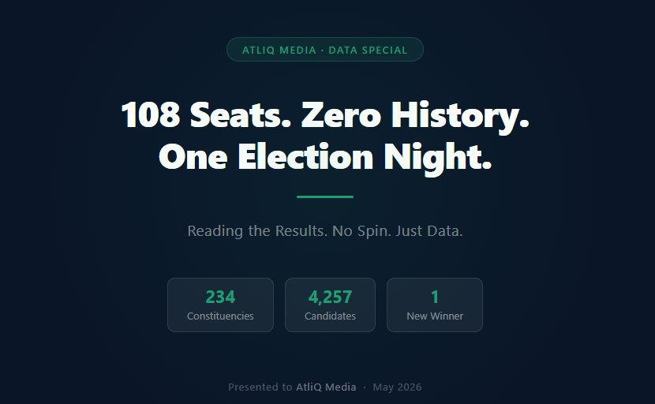
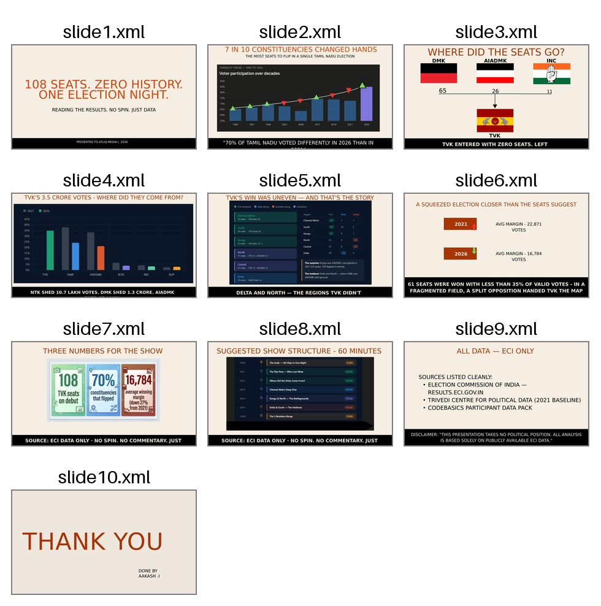
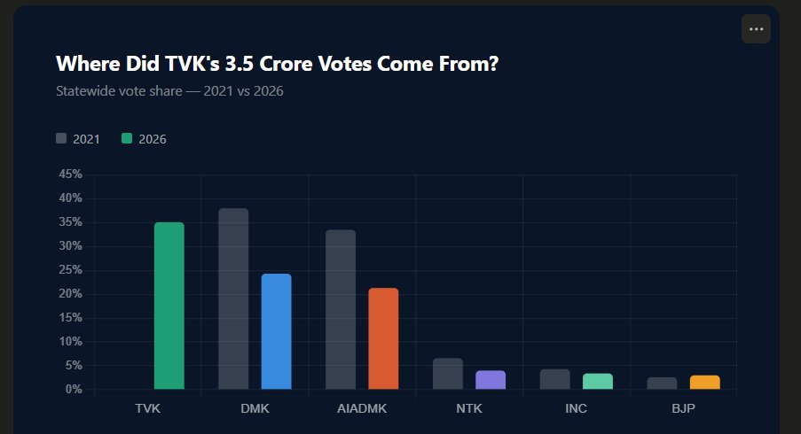
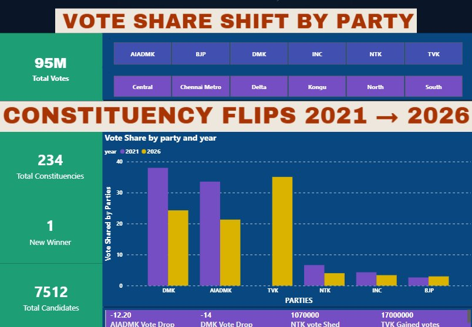
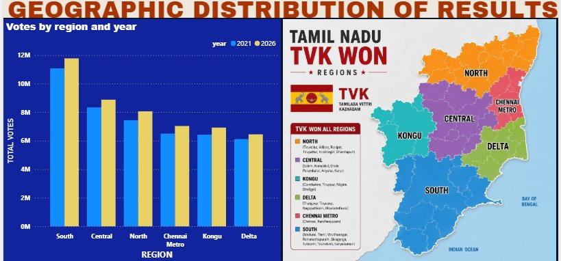

# 🗳️ Tamil Nadu 2026 Assembly Election — Data Story
### Codebasics Resume Project Challenge | AtliQ Media Pitch



> *"Reading the Results. No Spin. Just Data."*

---

## 📌 Project Overview

This project analyzes the **2026 Tamil Nadu Assembly Election results** and presents findings in a broadcast media format pitched to a fictional client — **AtliQ Media**.

The goal was not to explain why any party won or lost — but to find the most compelling data stories, support each with a clear visual, and pitch them in a way that helps AtliQ plan a **one-hour fact-based TV show.**

---

## 🎯 Problem Statement

AtliQ Media is producing a one-hour TV show on the 2026 Tamil Nadu Assembly Election results. Unlike most channels covering the election with debates and political commentary, AtliQ wants the opposite — a **clean, fact-based show grounded only in ECI data.**

---

## 📊 Research Questions Chosen

| # | Question | Story |
|---|----------|-------|
| Q1 | Geographic distribution of results | TVK's win was uneven — and that's the story |
| Q2 | Constituency flips 2021 → 2026 | 163 out of 234 seats changed hands |
| Q3 | Vote share shift by party | Where did 3.5 crore TVK votes come from? |

---

## 💡 Key Insights

| Insight | Number |
|---------|--------|
| TVK seats won on debut | **108 / 234** |
| Constituencies flipped | **163 (70%)** |
| DMK vote share drop | **38% → 24.3% (−13.7 pts)** |
| AIADMK vote share drop | **33.5% → 21.3% (−12.2 pts)** |
| NTK votes lost | **10.7 lakh** |
| DMK votes lost | **1.3 crore** |
| Chennai Metro sweep | **29 / 32 seats → TVK** |
| Average winning margin | **22,871 → 16,784 (↓27%)** |
| Seats won with <35% votes | **61 seats** |

---

## 📽️ Presentation Slides



### Slide 4 — Vote Share Shift



---

## 📊 Power BI Dashboard

### Page 1 — Vote Share Shift by Party



### Page 2 — Geographic Distribution of Results



---

## 🛠️ Tools Used

| Tool | Purpose |
|------|---------|
| 🐍 Python (Pandas) | Data cleaning and analysis |
| 📊 Power BI | Interactive dashboard |
| 🎨 Canva | Slide deck design |
| 📈 Chart.js | Supporting HTML visuals |
| 🐙 GitHub | Version control and hosting |

---

## 📁 Repository Structure

```
📦 tn-election-2026
 ┣ 📂 data
 ┃ ┣ tn_2026_results.csv
 ┃ ┣ tn_2021_results.csv
 ┃ ┗ constituency_master.csv
 ┣ 📂 dashboard
 ┃ ┗ tn_election_dashboard.pbix
 ┣ 📂 presentation
 ┃ ┗ CB-RESUME_CHLNGE.pptx
 ┣ 📂 visuals
 ┃ ┗ tn_election_dashboard.html
 ┣ 📜 README.md
```

---

## 🎬 Video Walkthrough

▶️ [Watch on LinkedIn](https://drive.google.com/file/d/1Mp17GhvvQ1xXXP7Dnb8bxRCuzrNc_2tB/view?usp=drive_link) 

---

## 📂 Data Sources

- 🏛️ **Election Commission of India** — [results.eci.gov.in](https://results.eci.gov.in)
- 📚 **Trivedi Centre for Political Data** — 2021 baseline reference
- 

> ⚠️ **Disclaimer:** This project takes no political position. All analysis is based solely on publicly available ECI data. This is a non-partisan data analysis exercise.

---

---

## 👤 Author

**Aakash J**
- 📍 Madurai, Tamil Nadu, India
- 🔗 [LinkedIn](www.linkedin.com/in/aakashilangovan37)

---

## 🏆 Submitted For

**Codebasics Resume Project Challenge**
Tamil Nadu 2026 Assembly Election Analysis


---

*Made with ❤️ using ECI data — No spin. No commentary. Just numbers.*
